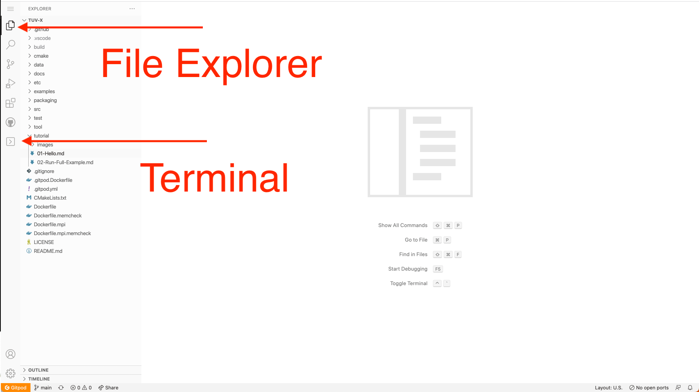

# TUV-x
## a photlysis rate calculator

Howdy! TUV-x stands for tropospheric ultraviolet-extended. It is a tool developed
by NCAR to calculate photolysis rates across many wavelength ranges.

You are currently in a gitpod environement; an online, interactive visual studio
code editor. This allows you to inspect the code of TUV-x as well as run the standalone
tool itself. We've written a tutorial to show you how to use the tool and configure it
for multiple use cases.

First, we'd like to point your attention to the left side of the screen. This
bar gives you access to a file editor and a terminal. Please click on each to
see what you can do.

[Part 2](02-Run-Full-Example.md)